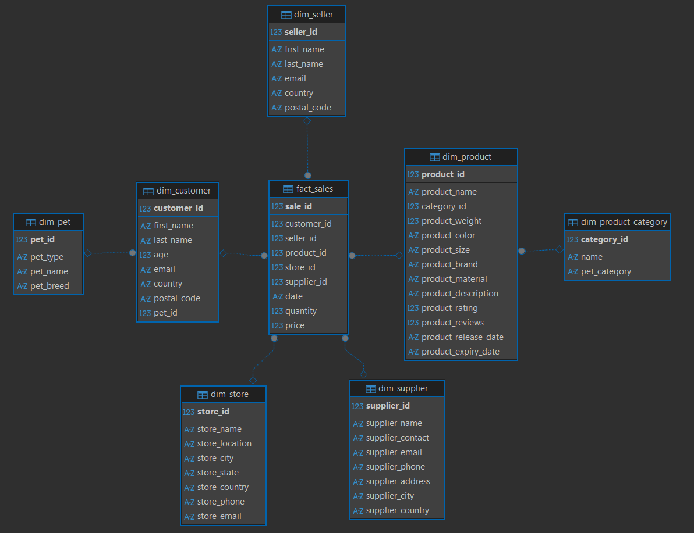

# Лабораторная работа №2: ETL реализованный с помощью Spark
## Анализ больших данных (Big Data)

### Работу выполнил
Студент группы М8О-315Б-23 Шаталов Максим Алексеевич

---

### Основная часть
В ходе выполнения лабораторной работы был реализован полный ETL-пайплайн с использованием Apache Spark, который автоматизирует все этапы обработки данных — от загрузки сырых CSV-файлов до формирования аналитических витрин. Apache Spark — это мощный распределенный вычислительный фреймворк с открытым исходным кодом, который выполняет вычисления в оперативной памяти, что критически важно для обработки больших объемов данных. Ключевыми абстракциями Spark являются DataFrame (распределенная коллекция строк с именованными колонками) и SparkSession (точка входа для всех операций, управляющая конфигурацией и соединениями).

Исходные данные представляли собой десять CSV-файлов (MOCK_DATA.csv ... MOCK_DATA (10).csv), каждый из которых содержал тысячу записей о продажах. Загрузка этих файлов была реализована непосредственно в Spark с использованием метода spark.read.csv. Для корректного чтения данных я задал явную схему через StructType, указав для каждого из полей соответствующий тип данных — IntegerType для идентификаторов, DecimalType для денежных сумм и StringType для текстовых полей. Это позволило избежать автоматического вывода типов, который мог привести к ошибкам. Также были применены опции multiLine=true и quote="\"" для корректной обработки многострочных полей, содержащих переносы строк в описании продуктов, а также mode="FAILFAST" для немедленного обнаружения ошибок при чтении.

После загрузки данных был выполнен анализ и выделение сущностей для построения модели звезда. Модель звезда — это архитектура хранилища данных, в которой одна центральная таблица фактов (fact_sales) содержит измеримые события (продажи), а окружающие ее таблицы измерений (dim_customer, dim_product, dim_seller, dim_store, dim_supplier, dim_pet, dim_product_category) содержат описательные атрибуты. Такая нормализация позволяет избежать дублирования информации и ускоряет аналитические запросы. В процессе трансформации возникли технические сложности с неоднозначностью колонок при выполнении join-операций, так как одинаковые имена полей присутствовали в нескольких таблицах. Проблема была решена путем явного указания источника колонок, например fact_sales["product_id"] вместо просто "product_id".

Для записи данных в PostgreSQL использовался JDBC-драйвер postgresql-42.7.4.jar. JDBC — это стандартный API для подключения к реляционным базам данных из Java-приложений. Spark использует распределенное соединение, где каждый исполнитель параллельно записывает свою порцию данных. Все таблицы измерений были успешно загружены, после чего сформирована таблица фактов fact_sales, объединяющая все измерения через внешние ключи.

На следующем этапе были созданы шесть витрин данных в ClickHouse для аналитических отчетов. Витрина данных — это агрегированная таблица, оптимизированная для конкретного аналитического запроса, содержащая уже вычисленные итоги, что ускоряет выполнение отчетов. Для подключения к ClickHouse использовался JDBC-драйвер clickhouse-jdbc-all-0.9.8.jar, а таблицы витрин были предварительно созданы с помощью DDL-скрипта с указанием движка MergeTree. Загрузка выполнялась в режиме append. В результате все шесть витрин были успешно заполнены и готовы к анализу через SQL-запросы в DBeaver. При создании витрин необходимо было проанализировать смысл витрины и написать грамотный запрос к таблице фактов, написать join по id и сделать необходимые группировки и агрегации. 

В итоге были написаны следующие скрипты:
| Скрипт                          | Описание                                                   |
| ------------------------------- | ---------------------------------------------------------- |
| `PostgreStarddl.sql`         | Импорт csv, создание таблиц схемы Звезда   |
| `ClickHouseMarketsddl.sql` | Создание нормализованных таблиц (dimension и fact таблицы) |
| `1_init_star_sheme.py`      | Перенос данных из сырой таблицы в финальную схему          |
| `2_make_markets.py`                    | Заполнение витрин данными и сохранение в ClickHouse          |

### Заключение

В результате работы был создан полностью автоматизированный ETL-пайплайн на Spark, который из сырых CSV-файлов строит нормализованную модель звезда в PostgreSQL, а затем формирует аналитические витрины в ClickHouse. Все скрипты и конфигурации помещены в репозиторий, а Docker-композ позволяет развернуть всю инфраструктуру одной командой docker-compose up. Было интересно выполнять работу, я изучил мощный инструмент spark и узнал, как работает обработка больших данных.